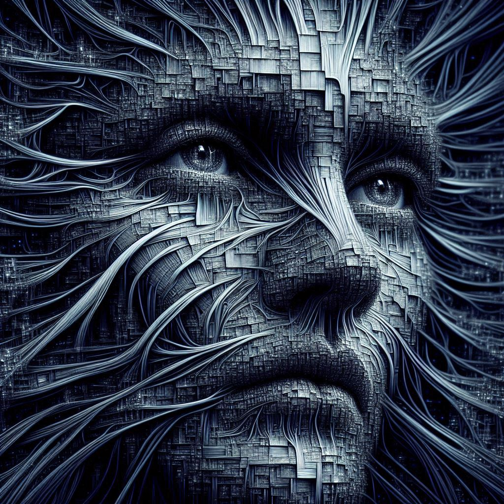

# **Segunda competición de Kaggle: Reconocimiento de Expresiones Faciales**  
>  
En esta competición se buscaba crear y entrenar un modelo de aprendizaje automático que, dada una fotografía de un rostro humano, pudiera reconocer la expresión/emoción en dicho rostro. El modelo debe predecir una de las 7 emociones principales: 'Asco', 'Enojo', 'Felicidad', 'Miedo', 'Sorpresa', 'Tristeza' y 'Neutral'. Como dataset disponemos de una colección de fotografías en blanco y negro y con un tamaño de 48x48.

En mi caso particular, esta competición coincide con parte de mi proyecto individual, por lo que el EDA, transformaciones, modelado, evaluaciones y las explicaciones pertinentes están en el repositorio creado expresamente para dicho proyecto.

Debido a las particularidades de la entrega, un archivo CSV con solo dos columnas, se creó un archivo Jupyter Notebook, [`expresiones_kaggle.ipynb`](https://github.com/PepeReinaCampo/Kaggle-Reconocimiento-de-Expresiones-Faciales/blob/main/expresiones_kaggle.ipynb),
que genera dicho archivo. En él, usamos para las predicciones el modelo preentrenado (usando una red neuronal convolucional) con una precisión contra su propio test de poco más del 81% y con un loss de 1.5009. Este modelo dio como resultado un acierto ligeramente superior al 95% en la puntuación pública.  

  ## **Todo el proceso para obtener el modelo empleado esta en este [enlace.](https://github.com/PepeReinaCampo/proyectoML)**

  

